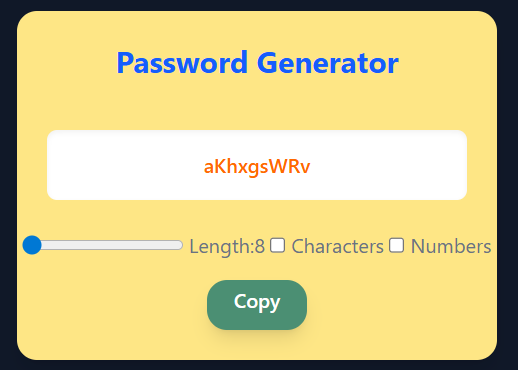

# Password Generator

A modern, responsive password generator built with React and Tailwind CSS. Generate secure passwords with customizable length and character sets including numbers and special characters.



## 🚀 Features

- **Customizable Length**: Generate passwords between 8-20 characters
- **Character Options**: Include/exclude numbers and special characters
- **One-Click Copy**: Copy generated passwords to clipboard instantly
- **Real-time Generation**: Passwords update automatically when settings change
- **Responsive Design**: Works seamlessly on desktop and mobile devices
- **Modern UI**: Clean, accessible interface with Tailwind CSS styling

## 🛠️ Tech Stack

- **Frontend Framework**: React
- **Styling**: Tailwind CSS
- **State Management**: React Hooks (useState, useEffect, useCallback, useRef)
- **Build Tool**: Vite

## 📦 Installation

### Prerequisites

- Node.js
- npm

### Setup

1. **Clone the repository**

   ```bash
   git clone https://github.com/subhajitbaidya/password-generator.git
   cd password-generator
   ```

2. **Install dependencies**

   ```bash
   npm install
   ```

3. **Start development server**

   ```bash
   npm run dev
   ```

## 🏗️ Project Structure

```
password-generator/
├── public/
├── src/
│   ├── App.jsx          # Main application component
│   ├── App.css         # Tailwind Config
│   └── main.jsx        # Application entry point
├── package.json
└── README.md
```

## 🔧 Component Architecture

### Main Component: `App.js`

The application consists of a single main component that handles all functionality:

#### State Variables

| State           | Type    | Default | Description                            |
| --------------- | ------- | ------- | -------------------------------------- |
| `length`        | number  | 8       | Password length (8-20 characters)      |
| `numberAllowed` | boolean | false   | Include numbers (0-9)                  |
| `characters`    | boolean | false   | Include special characters (!@#$%^&\*) |
| `password`      | string  | ""      | Generated password                     |

#### Key Functions

##### `passwordGenerator()`

- **Purpose**: Generates a new password based on current settings
- **Optimization**: Uses `useCallback` for performance optimization
- **Character Sets**:
  - Base: `A-Z, a-z` (always included)
  - Numbers: `0-9` (optional)
  - Special: `!@#$%^&*` (optional)

##### `copyPassword()`

- **Purpose**: Copies the generated password to clipboard
- **Features**:
  - Selects password text in input field
  - Uses Clipboard API for copying
  - Optimized with `useCallback`

#### Hooks Used

- **`useState`**: Managing component state
- **`useEffect`**: Auto-generating passwords when settings change
- **`useCallback`**: Optimizing function re-renders
- **`useRef`**: Direct access to password input element

## 🎨 UI Components

### Layout Structure

```jsx
<div className="h-screen w-screen flex justify-center items-center bg-gray-900">
  <div className="w-96 p-6 bg-amber-200 rounded-2xl shadow-lg">
    {/* Title */}
    {/* Password Display */}
    {/* Controls */}
    {/* Copy Button */}
  </div>
</div>
```

### Styling Classes

- **Container**: Full-screen centered layout with dark background
- **Card**: Amber-colored card with rounded corners and shadow
- **Input**: White background with inner shadow and orange text
- **Controls**: Inline flex layout with proper spacing
- **Button**: Green background with rounded corners and shadow

### Recommendations

- Default minimum length of 8 characters
- Enable both numbers and special characters for stronger passwords
- Consider adding more special characters for increased entropy

### 🚀 Deployment

- **GitHub Pages**: [Password Generator](https://subhajitbaidya.github.io/password-generator/)

## 🤝 Contributing

1. Fork the repository
2. Create a feature branch (`git checkout -b contribute/your-branch-name`)
3. Commit your changes (`git commit -m 'your feature comments'`)
4. Push to the branch (`git push origin contribute/your-branch-name`)
5. Open a Pull Request

**Thank you for visiting!**
